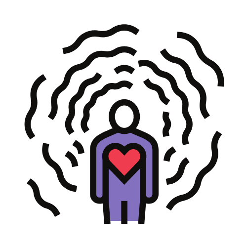

🚀Check out the configuration reference at : https://huggingface.co/docs/hub/spaces-config-reference

🚀Huggingface space : https://huggingface.co/spaces/prithivMLmods/ImageGPT-4XL

🚀The GitHub Model Workspace : 

    1. Install the client if you don't already have it installed.
    
    $ pip install gradio_client
    
    2. Find the API endpoint below corresponding to your desired function in the app. Copy the code snippet, replacing the placeholder values with your own input data. If this is a private Space, you may need to pass your Hugging Face token as well (read more). Or
    
    to automatically generate your API requests.
    api_name: /chat
    
    from gradio_client import Client
    
    client = Client("prithivMLmods/ImageGPT-4XL")
    result = client.predict(
    		message={"text":"","files":[]},
    		api_name="/chat"
    )
    print(result)
    
    Accepts 1 parameter:
    
    message Dict(text: str, files: List[filepath]) Default: {"text":"","files":[]}
    
    The input value that is provided in the "parameter_1" Multimodaltextbox component.
    Returns 1 element
    
    Dict(text: str, files: List[filepath])
    
    The output value that appears in the "value_1" Multimodaltextbox component.

## 🌚The image given to the gpt to process

## 🌝The processed from the model

## The examples given to the model: 

|  |  |
|---------------------------------|---------------------------------|
|  |  |

## Requirements.txt [ PyPI ]

    #flash_attn
    accelerate
    git+https://github.com/huggingface/transformers.git@main
    spaces
    torchvision
    Pillow

.

.

.
